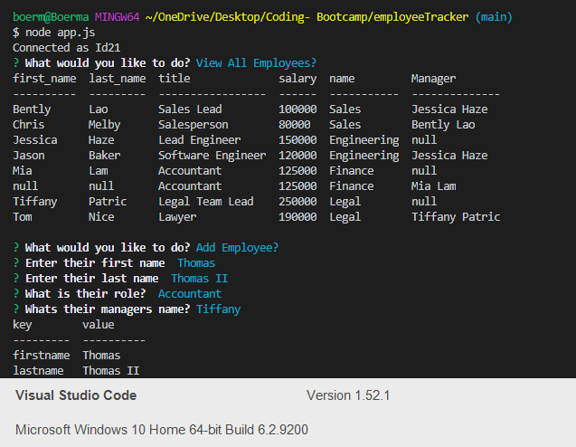

# Unit 12 MySQL Homework: Employee Tracker

The following application allows for you to view an employee database which includes three tables using a CLI.

Within the Command line you will be able to view, edit and add departments, roles and employees

Department
- ID
- NAME

Role
- ID
- Title
- Salary
- Department ID

Employee
- ID
- First and Last Name
- Role ID
- Manager ID

## Instructions

Using the terminal run

node app.js

## Tools used

MySQL Workbench
Node.js

## Dependencies

Inquirer
Console.table
Mysql

## Video showing functionality

(insert Gdrive link)
